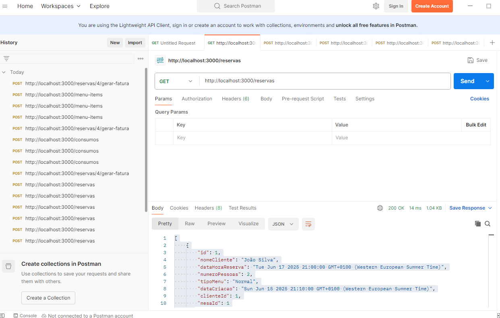
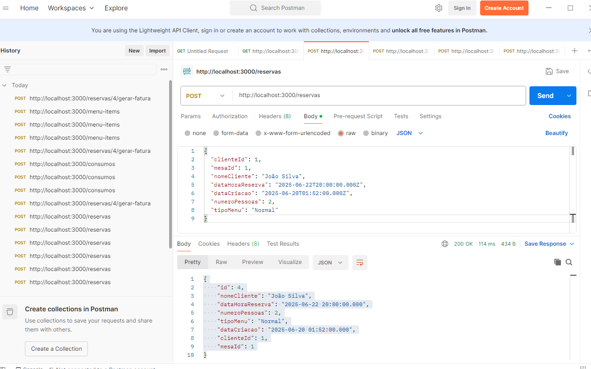
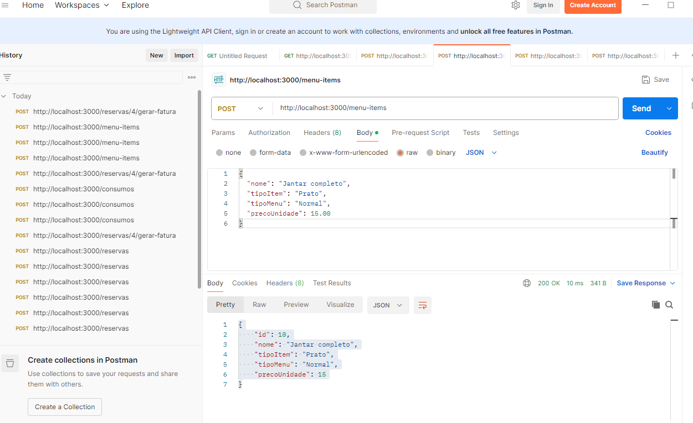
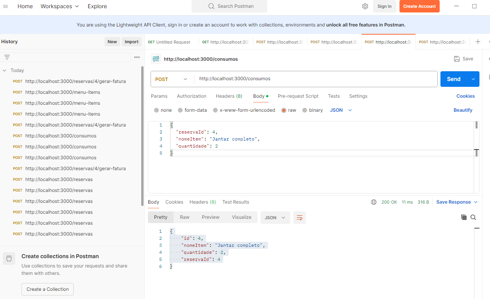
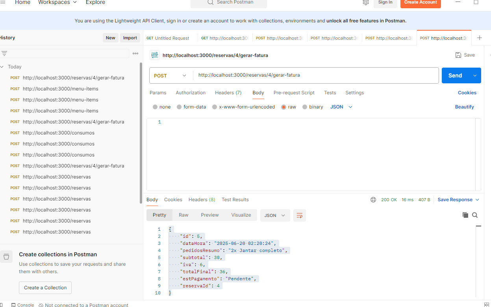

# C8: Organização e Justificação da Coleção Postman

---

## Estratégia Geral

A coleção Postman foi organizada de forma funcional, com foco no ciclo de vida de uma **reserva** num sistema de restauração. As entidades escolhidas refletem etapas chave do processo: criação de reservas, registo de consumos, associação de itens e geração de fatura.

A escolha dos métodos HTTP e a estrutura da coleção foram orientadas pelas operações necessárias para que uma reserva seja criada, gerida e finalizada corretamente.

---

## Organização por Endpoints

### 1. `GET /reservas`
- **Função:** Consultar todas as reservas existentes no sistema.
- **Justificação:** Permite que o administrador ou funcionário visualize as reservas atuais, futuras ou passadas.

<strong>Ver Print</strong>

---

### 2. `POST /reservas`
- **Função:** Criar uma nova reserva.
- **Justificação:** Essencial para o funcionamento do sistema — permite o registo de novos clientes ou mesas reservadas.

<strong>Ver Print</strong>

---

### 3. `POST /menu_item`
- **Função:** Adicionar um novo item ao menu.
- **Justificação:** Garante a manutenção dinâmica da carta (e.g., pratos, bebidas). Fundamental para associar posteriormente consumos à reserva.

<strong>Ver Print</strong>

---

### 4. `POST /consumos`
- **Função:** Registar os consumos efetuados durante uma reserva.
- **Justificação:** Permite associar itens do menu a uma reserva específica, para posterior faturação.

<strong>Ver Print</strong>

---

### 5. `POST /reservas/:id/gerar-fatura`
- **Função:** Gerar a fatura final de uma reserva, baseada nos consumos registados.
- **Justificação:** Conclui o ciclo da reserva, calculando o total a pagar. Método `POST` porque executa uma ação com efeito direto.

<strong>Ver Print</strong>

---

## Justificação dos Métodos HTTP Usados

| Método | Utilização                  | Justificação                                                    |
|--------|-----------------------------|-----------------------------------------------------------------|
| `GET`  | `/reservas`                 | Leitura de dados existentes, fundamental para listagens        |
| `POST` | `/reservas`, `/menu_item`, `/consumos`, `/reservas/:id/gerar-fatura` | Criação de dados ou execução de ações específicas |

> ⚠️ Apenas os métodos realmente necessários foram incluídos. Não há métodos como `PUT`, `PATCH` ou `DELETE`, pois o foco da coleção está em **ações principais**, e não em edições ou remoções.

---

## Conclusão

A coleção foi estruturada para refletir um **fluxo realista de gestão de reservas e consumos**, com ações encadeadas que vão desde a criação da reserva até à geração da fatura. A simplicidade e clareza da coleção permitem que o utilizador compreenda facilmente cada passo do processo, conforme demonstrado nos prints utilizados.

---
