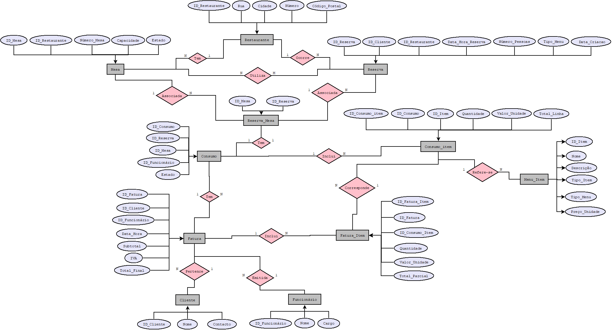

# Esquema Conceptual

## Modelo E/A

O sistema foi modelado com recurso ao Modelo Entidade-Associação, refletindo as principais entidades envolvidas na gestão de reservas e consumos em restaurantes com múltiplas localizações. Cada entidade e associação foi analisada para garantir uma estrutura lógica, eficiente e escalável.

### Diagrama do Modelo E/A

---

### Entidades

####  Restaurante
Representa uma das três localizações do restaurante. Cada restaurante tem uma morada distinta.
Atributos: ID_Restaurante , Cidade , Rua, Número, Código_Postal

#### Mesa
Cada restaurante tem várias mesas. Cada mesa tem um número visível e um identificador único no sistema.
Atributos: ID_Mesa , ID_Restaurante, Número_Mesa, Capacidade, Estado – Disponível | Pendente | Reservada

#### Cliente
Utilizador que realiza uma reserva.
Atributos:ID_Cliente , Nome, Contacto

####  Funcionário
Funcionário do restaurante que pode criar reservas manuais, registar consumos e emitir faturas.
Atributos: ID_Funcionário , Nome, Cargo

#### Reserva
Ação de reservar uma ou mais mesas para um cliente, num restaurante, numa data/hora específica.
Atributos:ID_Reserva, ID_Cliente, ID_Restaurante , Data_Hora_Reserva, Número_Pessoas, Tipo_Menu – Normal | Aniversário, Data_Criacao

#### Reserva_Mesa 
Entidade associativa para relacionar id_Reserva e id_Mesa
Atributos:ID_Reserva, ID_Mesa

####  Menu_Item
Itens disponíveis no menu do restaurante. Um item pode pertencer ao menu normal, de aniversário ou ambos.
Atributos:ID_Item , Nome, Descrição, Tipo_Item – Entrada, Prato, Bebida, Sobremesa, Tipo_Menu – Normal | Aniversário, Preço_Unidade

#### Consumo
Um consumo é gerado para cada mesa usada numa reserva
Atributos:ID_Consumo , ID_Reserva , ID_Mesa , ID_Funcionário,Estado_Pagamento-Pendente | Parcial | Pago

#### Consumo_item
É adicionado os pedidos feitos ,representa o que foi efetivamente consumido por item.
Atributos:ID_Consumo_item , ID_Consumo, ID_Item , Quantidade,Valor_Unidade, Total_Linha

#### Fatura
Ligada aos itens que compõem parte ou total de um consumo.
Atributos:ID_Fatura, ID_Cliente , ID_Funcionário,  Data_Hora, Subtotal, IVA, Total_Final

#### Fatura_Item
Permite faturas parciais de um consumo (ex: dividir conta).
Atributos:ID_Fatura_Item, ID_Fatura , ID_Consumo_Item, Quantidade, Valor_Unidade, Total_Parcial

---

### Associações

- Restaurante — Mesa → 1:N
Um restaurante tem várias mesas.

- Restaurante — Reserva → 1:N
Uma reserva ocorre num restaurante

- Reserva — Mesa → N:M
Uma reserva pode usar várias mesas

- Reserva_Mesa — Consumo → 1:1
Cada mesa numa reserva tem um único consumo

| Entidade A    | Entidade B    | Cardinalidade | Descrição                                   |
| ------------- | ------------- | ------------- | ------------------------------------------- |
| Restaurante   | Mesa          | 1\:N          | Um restaurante tem várias mesas             |
| Restaurante   | Reserva       | 1\:N          | Uma reserva ocorre num restaurante          |
| Reserva       | Mesa          | N\:M          | Uma reserva pode usar várias mesas          |
| Reserva\_Mesa | Consumo       | 1:1           | Cada mesa numa reserva tem um único consumo |
| Consumo       | Consumo\_Item | 1\:N          | Um consumo tem várias linhas de item        |
| Consumo\_Item | Menu\_Item    | N:1           | Cada linha refere-se a um item do menu      |
| Consumo       | Fatura        | 1\:N          | Um consumo pode ter várias faturas          |
| Fatura        | Fatura\_Item  | 1\:N          | Uma fatura inclui parte ou todo o consumo   |
| Fatura\_Item  | Consumo\_Item | N:1           | Linha de fatura aponta para item consumido  |
| Fatura        | Cliente       | N:1           | Uma fatura é associada a um cliente         |
| Fatura        | Funcionário   | N:1           | Uma fatura é emitida por um funcionário     |

---

## Regras de negócio adicionais (Restrições)

- **Gestão de Estados da Mesa**
Uma mesa em estado "Pendente" fica temporariamente reservada por 5 minutos. Se não for confirmada, volta automaticamente a "Disponível".

Funcionários não podem reservar manualmente mesas em estado "Pendente".

Após o almoço ou jantar, a mesa só muda de estado (para “Disponível”) por ação manual do funcionário.

A mesa só fica “Disponível” após o registo de pagamento manual e emissão da fatura.

Não é possível efetuar reservas sobrepostas na mesma data/hora para a mesma mesa.

- **Regras para Grupos**
Reservas com mais de 8 pessoas não podem escolher a mesa manualmente — o sistema escolhe automaticamente mesas compatíveis (em número e capacidade).

- **Pagamentos e Faturação**
As faturas só são emitidas após o registo de pagamento manual feito por um funcionário.

Só pode haver uma fatura por reserva.

A mesa é libertada (estado = “Disponível”) após o pagamento e emissão da fatura.

- **Menu e Consumos**
Quantidade e preço dos itens consumidos devem ser consistentes com o menu pré-definido (preço puxado automaticamente).

Apenas funcionários podem registar consumos, e apenas para reservas ativas.

Os itens consumidos devem pertencer ao tipo de menu escolhido na reserva (Normal ou Aniversário).

O total do consumo é calculado automaticamente (quantidade × preço), e o total da fatura inclui IVA (se aplicável).

- **Tempo e Reserva**
A data da reserva não pode ser anterior à data atual (sem reservas retroativas).

A data de criação da reserva deve ser registada obrigatoriamente.

O sistema valida automaticamente a disponibilidade de mesas no momento da reserva, evitando sobreposições.

---

| [< Previous](rebd01.md) | [^ Main](../../README.md) | [Next >](rebd03.md) |
|:----------------------------------:|:----------------------------------:|:----------------------------------:|

