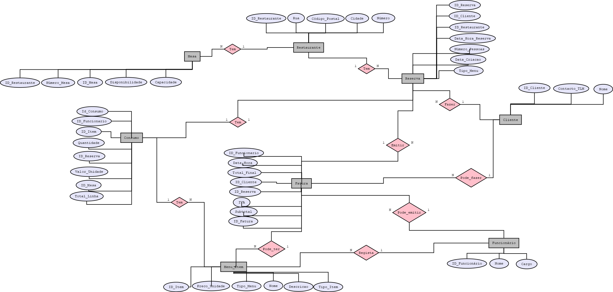

# Esquema Conceptual

## Modelo E/A

O sistema foi modelado com recurso ao Modelo Entidade-Associação, refletindo as principais entidades envolvidas na gestão de reservas e consumos em restaurantes com múltiplas localizações. Cada entidade e associação foi analisada para garantir uma estrutura lógica, eficiente e escalável.

### Diagrama do Modelo E/A

---

### Entidades

####  Restaurante
Representa uma das três localizações do restaurante. Cada restaurante tem uma morada distinta.
Atributos: ID_Restaurante , Cidade , Rua, Número, Código_Postal

#### Mesa
Cada restaurante tem várias mesas. Cada mesa tem um número visível e um identificador único no sistema.
Atributos: ID_Mesa , ID_Restaurante, Número_Mesa, Capacidade, Estado – Disponível | Pendente | Reservada

#### Cliente
Utilizador que realiza uma reserva.
Atributos:ID_Cliente , Nome, Contacto

####  Funcionário
Funcionário do restaurante que pode criar reservas manuais, registar consumos e emitir faturas.
Atributos: ID_Funcionário , Nome, Cargo

#### Reserva
Ação de reservar uma ou mais mesas para um cliente, num restaurante, numa data/hora específica.
Atributos:ID_Reserva, ID_Cliente, ID_Restaurante , Data_Hora_Reserva, Número_Pessoas, Tipo_Menu – Normal | Aniversário, Data_Criacao

####  Menu_Item
Itens disponíveis no menu do restaurante. Um item pode pertencer ao menu normal, de aniversário ou ambos.
Atributos:ID_Item , Nome, Descrição, Tipo_Item – Entrada, Prato, Bebida, Sobremesa, Tipo_Menu – Normal | Aniversário, Preço_Unidade

#### Consumo
Registo do que foi consumido numa reserva. Associado à mesa, ao funcionário que registou e aos itens do menu.
Atributos:ID_Consumo , ID_Item , ID_Reserva , ID_Mesa , ID_Funcionário, Quantidade, Valor_Unidade, Total_Linha

#### Fatura
Documento gerado após o pagamento, com os detalhes do consumo.
Atributos:ID_Fatura , ID_Reserva , ID_Cliente , ID_Funcionário, Subtotal, IVA, Total_Final , Data_Hora

---

### Associações

- Restaurante — Mesa → 1:N
Um restaurante tem várias mesas, mas cada mesa pertence apenas a um restaurante.

- Restaurante — Reserva → 1:N
Um restaurante pode ter muitas reservas, mas cada reserva ocorre num único restaurante.

- Cliente — Reserva → 1:N
Um cliente pode fazer várias reservas, mas cada reserva pertence a um único cliente.

- Reserva — Mesa → N:M (via Reserva_Mesa)
Uma reserva pode usar várias mesas, e uma mesa pode ser usada em várias reservas (em momentos diferentes). É corretamente modelado por uma associação.

- Reserva — Consumo → 1:N
Cada reserva pode ter vários consumos associados (itens pedidos), mas cada consumo está ligado a uma única reserva.

- Consumo — Menu_Item → N:1
Vários consumos podem referir-se ao mesmo item do menu (ex: várias pessoas pedem o mesmo prato).

- Consumo — Funcionário → N:1
Um funcionário pode registar vários consumos, mas cada consumo é registado por um único funcionário.

- Reserva — Fatura → 1:1
Cada reserva gera, no máximo, uma fatura; e cada fatura refere-se a uma única reserva.

- Funcionário — Fatura → 1:N
Um funcionário pode emitir várias faturas, mas cada fatura é emitida por apenas um funcionário.

- Cliente — Fatura → 1:N
Um cliente pode ter várias faturas (várias reservas ao longo do tempo), mas cada fatura refere-se a um único cliente.
  
---

## Regras de negócio adicionais (Restrições)

- **Gestão de Estados da Mesa**
Uma mesa em estado "Pendente" fica temporariamente reservada por 5 minutos. Se não for confirmada, volta automaticamente a "Disponível".

Funcionários não podem reservar manualmente mesas em estado "Pendente".

Após o almoço ou jantar, a mesa só muda de estado (para “Disponível”) por ação manual do funcionário.

A mesa só fica “Disponível” após o registo de pagamento manual e emissão da fatura.

Não é possível efetuar reservas sobrepostas na mesma data/hora para a mesma mesa.

- **Regras para Grupos**
Reservas com mais de 8 pessoas não podem escolher a mesa manualmente — o sistema escolhe automaticamente mesas compatíveis (em número e capacidade).

- **Pagamentos e Faturação**
As faturas só são emitidas após o registo de pagamento manual feito por um funcionário.

Só pode haver uma fatura por reserva.

A mesa é libertada (estado = “Disponível”) após o pagamento e emissão da fatura.

- **Menu e Consumos**
Quantidade e preço dos itens consumidos devem ser consistentes com o menu pré-definido (preço puxado automaticamente).

Apenas funcionários podem registar consumos, e apenas para reservas ativas.

Os itens consumidos devem pertencer ao tipo de menu escolhido na reserva (Normal ou Aniversário).

O total do consumo é calculado automaticamente (quantidade × preço), e o total da fatura inclui IVA (se aplicável).

- **Tempo e Reserva**
A data da reserva não pode ser anterior à data atual (sem reservas retroativas).

A data de criação da reserva deve ser registada obrigatoriamente.

O sistema valida automaticamente a disponibilidade de mesas no momento da reserva, evitando sobreposições.

---

[< Previous](rei02.md) | [^ Main](/../../) | Next >
:--- | :---: | ---:
